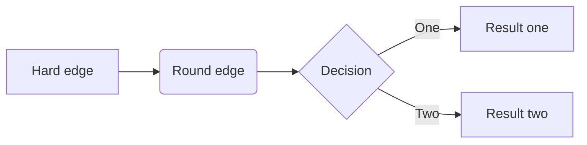

#### 数据结构简介

#### 常用内置算法和数据结构

| 数据结构 | 语言内置         | 内置库                                            |
| -------- | ---------------- | ------------------------------------------------- |
| 线性结构 | list \| tuple    | array \| collections.namedtuple                   |
| 链式结构 |                  | collections.deque                                 |
| 字典结构 | dict             | collections.Counter \| OrderedDict \| defaultdict |
| 集合结构 | set \| frozenset |                                                   |
| 排序算法 | sorted           |                                                   |
| 二分算法 |                  | bisect                                            |
| 堆算法   |                  | heapq                                             |
| 缓存算法 |                  | functools.lru_cache                               |

| 算法     | 语言内置 | 内置库                                          |
| -------- | -------- | ----------------------------------------------- |
| 排序算法 | sorted   |                                                 |
| 二分算法 |          | bisect模块                                      |
| 堆算法   |          | heapq模块                                       |
| 缓存算法 |          | functools.lru_cache(Least Recent Used, python3) |

#### 参考

https://leetcode-cn.com/leetbook/read/illustration-of-algorithm/50e446/

https://pegasuswang.github.io/python_data_structures_and_algorithms/